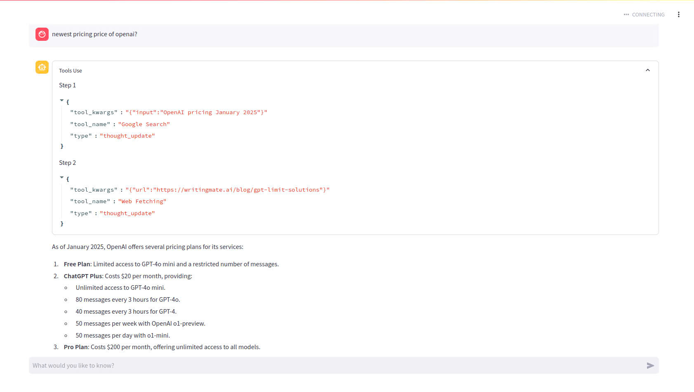

# Google Search Agent Assistant 🔍

An intelligent search assistant powered by LangChain and Streamlit that helps you find and summarize information from the web in real-time.

## 📸 Demo

Here's what the app looks like in action:



## 🌟 Features

- **Real-time Web Search**: Utilizes Google Search to find the most relevant information
- **Dynamic Content Fetching**: Automatically retrieves and processes webpage content
- **Interactive UI**: Built with Streamlit for a smooth user experience
- **Tool Use Transparency**: See exactly how the agent processes your query with an expandable tools log
- **Streaming Responses**: Get information as it's being processed, no need to wait for complete responses

## 🛠️ Technology Stack

- **Frontend**: Streamlit
- **Backend**: Python, LangChain
- **AI/ML**: GPT-4o-mini for natural language processing
- **Tools**: 
  - Google Search Integration
  - Web Content Fetching
  - Real-time Response Streaming

## 🚀 Getting Started

1. **Clone the repository**
   ```bash
   git clone https://github.com/Xphi310302/google-search-agent-assistant.git
   cd search-agent
   ```

2. **Install Poetry (if not already installed)**
   ```bash
   pip install poetry
   ```

3. **Install dependencies using Poetry**
   ```bash
   poetry install
   source $(poetry env info --path)/bin/activate  # Activate the virtual environment
   ```

4. **Set up environment variables**
   ```bash
   # Create a .env file with your API keys
   OPENAI_API_KEY=your_openai_api_key
   GOOGLE_SEARCH_API_KEY=your_google_search_api_key
   GOOGLE_SEARCH_ENGINE_ID=your_google_search_engine_id
   ```

5. **Run the application**
   ```bash
   streamlit run main.py
   ```

## 💡 Usage

1. Enter your search query in the chat input
2. Watch as the agent:
   - Searches Google for relevant information
   - Fetches and processes webpage content
   - Provides a comprehensive response
3. View the Tools Use expander to see how the agent processes your query

## 🔄 How It Works

1. **Query Processing**: Your input is processed by the LangChain agent
2. **Tool Selection**: The agent decides which tools to use:
   - Google Search for finding relevant sources
   - Web Fetching for retrieving detailed content
3. **Response Generation**: Information is synthesized into a coherent response
4. **Real-time Updates**: See the process through the Tools Use expander

## 📝 Project Structure

```
search-agent/
├── main.py           # Main Streamlit application
├── agent/            # Agent implementation
│   ├── base.py      # Base agent class
│   └── tools/       # Tool implementations
├── config/          # Configuration files
├── utils/           # Utility functions
└── README.md        # Project documentation
```
## 📝 Todo List

- [ ] Do some experiments with some other crawler tools for more reliable results

## 📄 License

This project is licensed under the MIT License - see the [LICENSE](LICENSE) file for details.

## 👤 Author

Phi Nguyen Xuan
- LinkedIn: [Phinx](https://www.linkedin.com/in/phinx/)
- Website: https://phinx.vercel.app

---


Built with ❤️ using LangChain and Streamlit